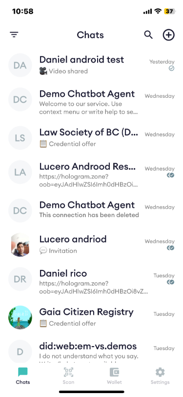
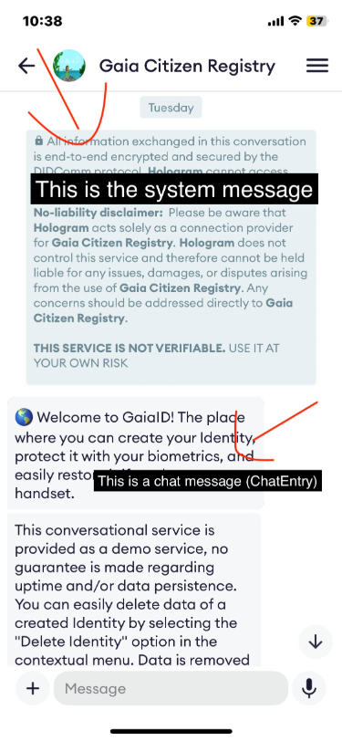
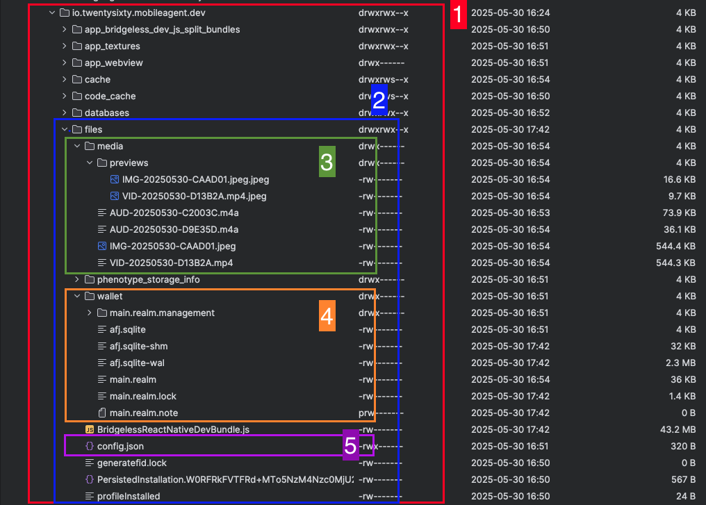

## About file system in Hologram

Hologram uses different strategies to store files and information in devices. Some of them are encrypted due to security reasons and they can not be stored as plain info. Another files are just stored as plain data due to they does not contain sensitive information just settings or configuration values. Strategies or engines used range from encrypted databases to .json archives

### What do we store in local encrypted databases?

For local databases we use [Realm](https://github.com/realm/realm-js). In this mobile encrypted database we store information in Entities structure such as:

**ChatThread**: This entity is responsible for storage every single chat thread. A new ChatThread is created when user is connected to a new service or p2p connection. Let's see it better with an example.



Description: As you can see in image there are 9 Chats. Technically speaking they are 9 ChatThread objects

**ChatEntry**: This entity is responsible for storage every single item in chat. In other words, it represents a single chat message, no matter what type of message is. As you can see in image bellow pointed messages are ChatEntry objects from first system message until last message in chat are ChatEntry objects.

**Disclaimer:** Sticky dates are visual elements that are part of a chat and are calculated on the fly but they are not ChatEntry objects



**UploadTask**: This entity is responsible for storage an upload task and its chunks for each media item (voice note, image or video) to be upload to [2060 Data Store API](https://github.com/2060-io/2060-datastore) and then share it using DIDComm [Media Sharing](https://didcomm.org/media-sharing/1.0/) protocol. Main purpose of this entity is to storage current media item upload status and allow to app to resume uploading file if something is wrong (internet connection is lost, user closes app)

**CacheRecord**: This entity is responsible for storage base64 string format of every avatar image of a connection (Mainly for services connections). Its main purpose is to allow to set image of avatar quickly and only update it if last-modified from server where is located this image is greater than current last-modified of cache record object

### What do we store with Async Storage?

Async Storage is an asynchronous, unencrypted, persistent, key-value storage system [for React Native](https://github.com/react-native-async-storage/async-storage). Async Storage can only store string data. So, to persist objects and other type of typos we need to use JSON.stringify() when saving the data and JSON.parse() when loading the data. This storage system is mainly used to store no sensitive user or app information. (e.g. A key-value to indicates if user has enable developer mode in app or a key-value to indicates if backup must include media files when built). If you want to see full key-values used in app you can go to [src/services/localStorage/index.ts](../src/services/localStorage/index.ts)

### What do we store in .json config file?

This is nothing more than a .json file stored with the next structure:

```json
{
  "keys": {
    "afj-wallet": "encrypted-value",
    "realm-main": "encrypted-value",
    "backup": "encrypted-value",
    "parental-control-pin": "encrypted-value"
  },
  "parental-control": {
    "enabled": "boolean value in string format",
    "kid-birthday": "DD-MM-YYYY"
  }
}
```

#### Explanation:

**keys**

Everything under "keys" are encrypted values.

- `afj-wallet`: Encrypted string value that is used to create and import sqlite db agent wallet

- `realm-main`: Encrypted string value that is used to open Realm

- `backup`: Encrypted string value for backup password that user set when builds backup and needs to provide when restores his wallet

- `parental-control-pin`: Encrypted string value that indicates the PIN that user set to enable parental control and its necessary to provide if want to disable parental control or change kid birthdate

**parental-control**

- `enabled`: A boolean value in string format that indicates if user has enabled parental control in app

- `kid-birthday`: A date string in format DD-MM-YYYY that indicates kid birthdate set by parent

### What about media content?

All media content (voice notes, images and videos) are stored into app package context. It means these files lives in a secure and sandboxed place where only app code can access to those files. Both Android and iOS have implemented security rules so that we or another apps have no access to those files outside app context. For media content we have main directory called **media** where lives all media content. But also we have a subdirectory inside it called **previews** in this subdirectory we place all previews (thumbnails videos and images in lower resolution). Purpose of this **previews** is to displayed them in chat screen to avoid to render large media items in screen (Performance reason). Only when user press image is going to see the image in full screen and with the best resolution. To sump up per every image and video in **media** there is its corresponding image inside **previews** subdirectory

### Precise location of all these files:

All app stored content except for Async Storage (it uses a different locations) is stored in DocumentDirectoryPath where its location varies between Android and iOS.

For iOS DocumentDirectoryPath in app dev release resolves to:

/var/mobile/Containers/Data/Application/io.2060.mobileagent.dev/Documents

For Android DocumentDirectoryPath in app dev release resolves to:

/data/user/0/io.twentysixty.mobileagent.dev/files
or
/data/data/io.twentysixty.mobileagent.dev/files

Let's remember those routes are not accessible without root unless via the app itself

Let's see how looks a files structure in Android



Explanation of structure:

1. **io.twentysixty.mobileagent** directory: Refers to app it self main container
2. **files** directory: Refers to created or assigned root directory for DocumentDirectoryPath in android. All values that uses that DocumentDirectoryPath are going to be located inside it
3. **media** directory: Refers to directory where all media content lives. Inside it there is a subdirectory called **previews** where you know thumbnails for videos and images in lower resolution are stored
4. **wallet** directory: Refers to DB files stored. Realm and afj sqlite wallet files
5. **config.json**: Refers to explained .json config file above

### Which of all this information is saved when user builds a wallet backup?

Included:

- Realm database
- Agent wallet sqlite db

Not included:

- Async Storage values
- .json config file

It means that if user creates a backup and then restore it. Values in Async Storage and json config file are going to start from scratch it means with default app installation values. Only agent wallet db and local realm database are going to be restored

### For detailed information about backup process see [Backup.md](./Backup.md)