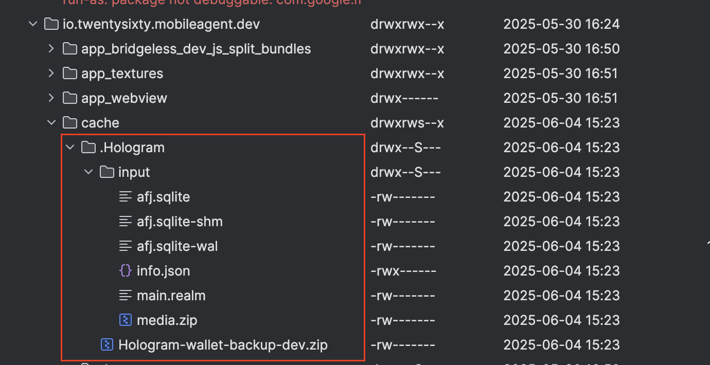

### Let's talk a little bit about Backup created file structure

One of Hologram features is to allow to user to create a backup of his wallet. This functionality helps user to restore his wallet in other device. At the moment, is not a cross-platform backup. In other words, if backup was built in Android only in an Android device is going to be able to restore his wallet, same way occurs for iOS. Not because files has a different structure or varies something on each platform. By the way, technically speaking would be possible. The constraint is that we upload those backups in Google Drive for Android and iCloud for iOS. In that way, when user wants to restore his wallet in Android is going to looks for backup file in Google Drive and in iCloud for iOS.

Before start, Hologram creates a .zip file and upload it to cloud on each platform. This is done to decrease the final file upload size. When Hologram creates this .zip file only keeps it until backup upload to cloud is finished or backup built process fails, after all Hologram deletes it. But, let's see how is the structure of this temporary backup file.

As you can in image above there is a directory called **.Hologram** in cache directory. It contains a .zip file which will be uploaded to cloud and also contains a directory called **input**. In that vein let's talk about each file that composes this **.zip** file or otherwise **input** directory.

- `info.json`: Manifest file containing information about the backup itself. It is mostly used to let future versions of Hologram how to treat the backup based on this version (as file structure may differ)
- `afj.sqlite`: Credo's wallet in SQLite format (might also include sch and wal file, needed for later importing of the DB)
- `main.realm`: Realm's main database. Which will allow to user to see his created chats and chats history conversations when restores wallet
- `media.zip`: This zip contains both images, videos, voice notes and preview images for videos and images in chats conversations to avoid to user has to re-download them when restores wallet. Compressed in zip format

#### Manifest file

`info.json` has been introduced in Hologram 2.3.0. If not present, the backup must be considered to be following the first backup schema (`1`).

It is a JSON file that currently includes the following fields:

- `schemaVersion`: numeric field indicating the backup schema version. It starts with `1`. Every time something changes within the backup file structure and policy (e.g. options to select or ignore files in backup), it should be increased
- `appVersion`: string containing app version used to generate this backup (e.g. `2.3.0`)