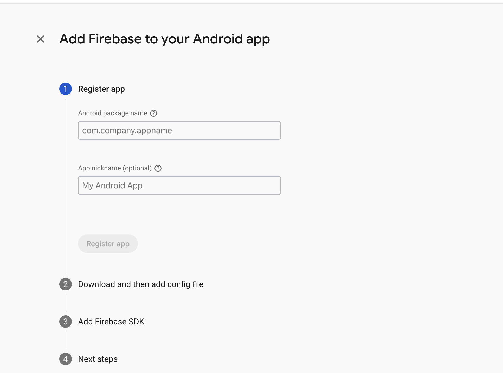
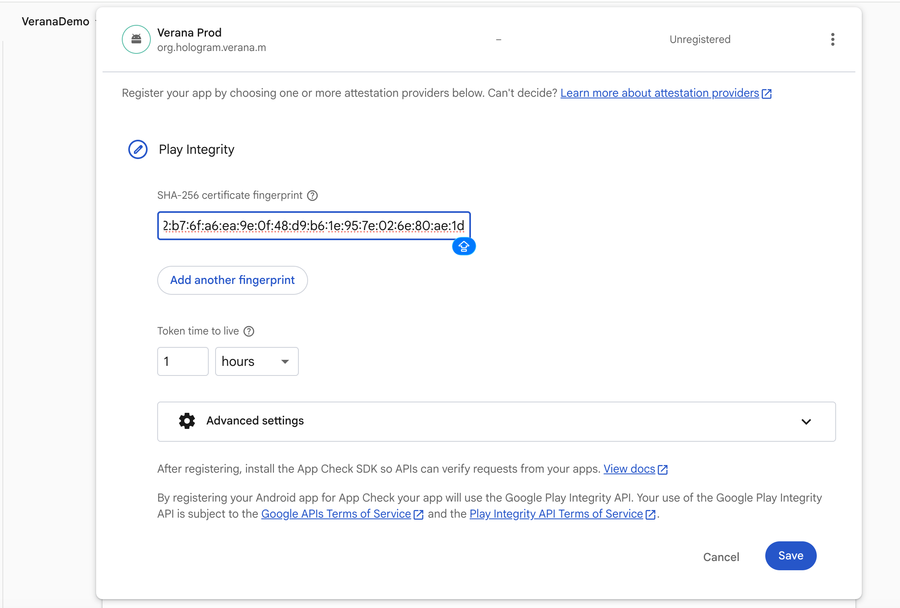
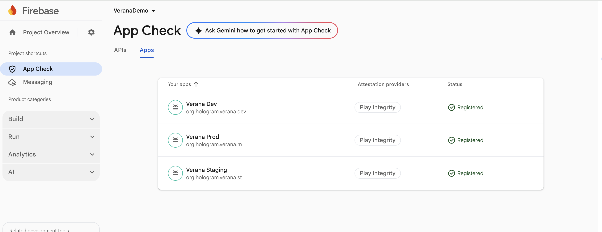
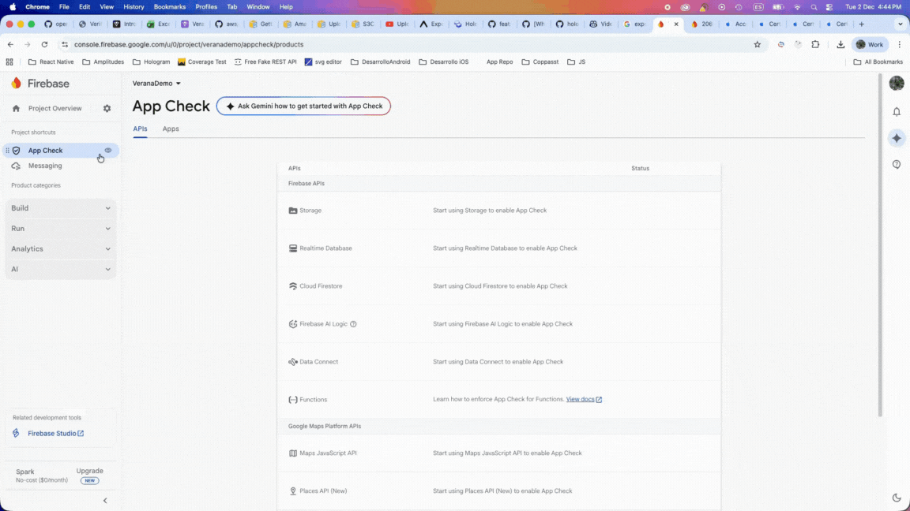
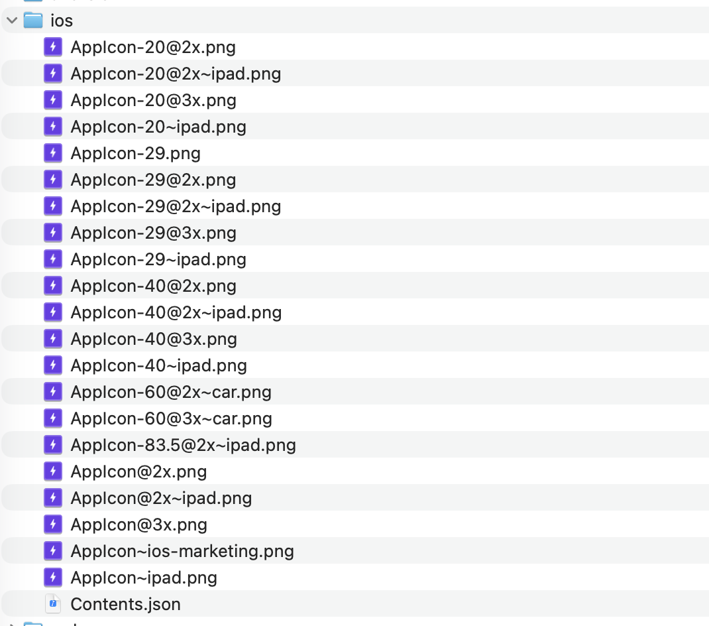
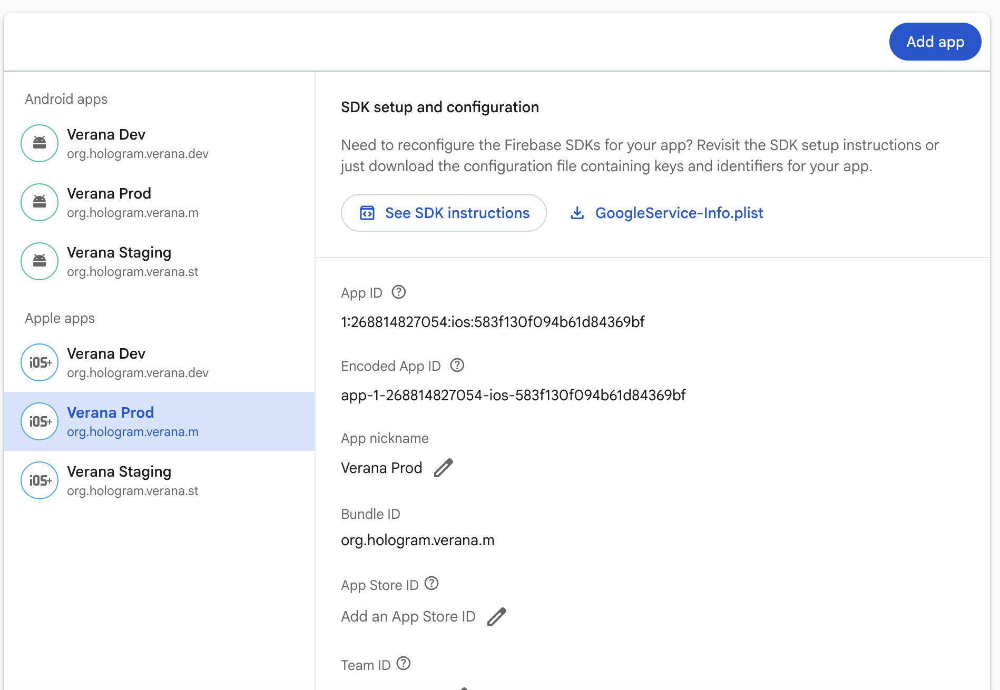
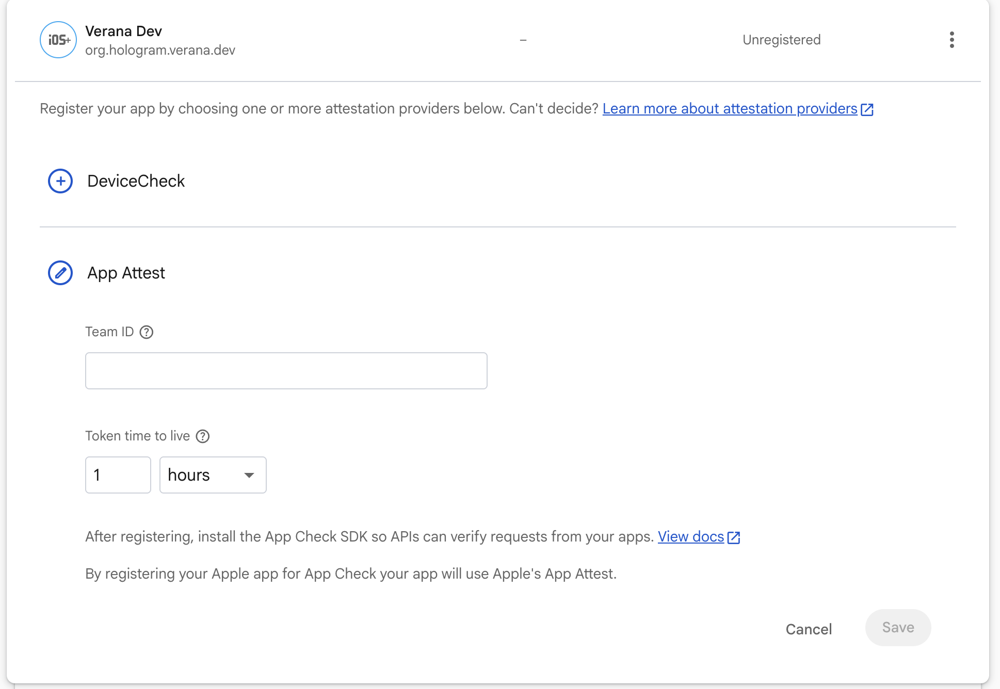
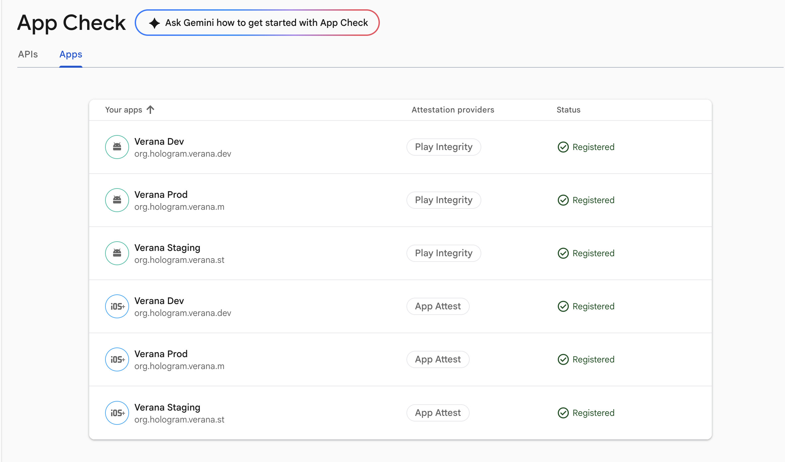
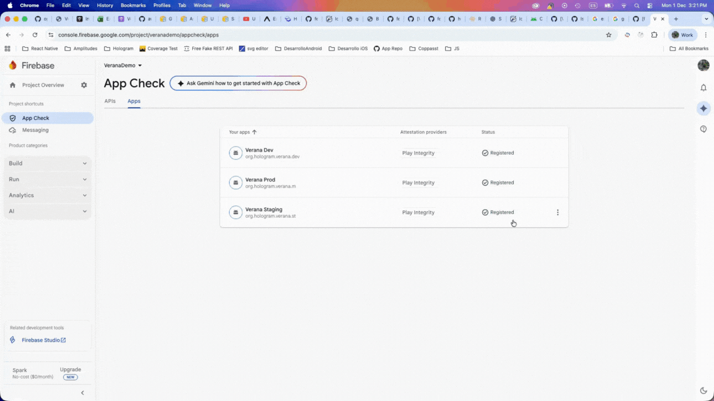

# 🏷️ White Label Setup Guide

## 📋 Table of Contents
- [Overview](#overview)
- [Project Structure](#project-structure)
- [Environment Configuration](#environment-configuration)
- [Firebase Android Setup](#firebase-android-setup)
- [Firebase iOS Setup](#firebase-ios-setup)
- [React Native Configuration](#react-native-configuration)

---

## 🎯 Overview

One of Hologram's key features is the ability to customize it into a branded app. This guide will walk you through the process of customizing your app name, app icon, splash screen, and app identifiers.

### What You'll Customize

To white-label this application, you need to modify **3 key areas**:
- 🤖 **Android**
- 🍎 **iOS**
- ⚛️ **React Native**

We've created automation scripts that will replace the app's default values with your custom configuration.

---

## 📁 Project Structure

### Root Directory

Navigate to `white_labels/verana` where you'll find the following structure:


This directory contains:
- `android/` - Android-specific resources
- `ios/` - iOS-specific resources
- `.env.example` - Environment variables template

> ⚠️ **IMPORTANT**: The directory structure mirrors a typical React Native project. **Do not modify file names or folder organization** - only update the file contents.

---

### 🤖 Android Structure


**Location**: `white_labels/verana/android/`

**Contents**:
- App icon resources for different screen densities
- `google-services.json` - Firebase configuration file (to be replaced with your Firebase project data)

---

### 🍎 iOS Structure


**Location**: `white_labels/verana/ios/`

#### Firebase Directory (`Firebase/`)
Contains 3 Firebase configuration files:
- `GoogleService-Info-Dev.plist`
- `GoogleService-Info-Staging.plist`
- `GoogleService-Info-Prod.plist`

#### Images Directory (`Images.xcassets/`)
Contains 2 subdirectories:

1. **`AppIconStaging.appiconset/`**
   - Place all required app icon sizes for Apple's requirements

2. **`SplashScreenIconStaging.imageset/`**
   - Place your splash screen icon

---

## ⚙️ Environment Configuration

### Environment Variables

The `.env.example` file contains the following variables:

| Variable | Description | Example |
|----------|-------------|---------|
| `APP_NAME` | Display name of your app | `"Verana"` |
| `BASE_APP_ID` | Base bundle identifier | `"org.hologram.verana"` |
| `ANDROID_SPLASH_SCREEN_COLOR` | Splash screen background color (hex) | `"#6A3DE7"` |
| `ANDROID_FIREBASE_DEBUG_TOKEN` | Firebase Debug Token for Android | - |
| `IOS_SPLASH_SCREEN_COLOR_R` | iOS splash background - Red (sRGB) | `"0.417"` |
| `IOS_SPLASH_SCREEN_COLOR_G` | iOS splash background - Green (sRGB) | `"0.239"` |
| `IOS_SPLASH_SCREEN_COLOR_B` | iOS splash background - Blue (sRGB) | `"0.908"` |
| `IOS_FIREBASE_DEBUG_TOKEN` | Firebase Debug Token for iOS | - |
| `APP_ICON_BASE64` | Data URI of your app icon | `"data:image/png;base64,..."` |

> 💡 **Note**: iOS requires splash screen colors in sRGB format (0-1 range). The example values above convert to `#6A3DE7` in hexadecimal.

---

### 🔖 App Identifier Structure

This app supports **three release types**: `dev`, `staging`, and `prod`. This allows you to have all three versions installed simultaneously on a device as independent apps.

#### Identifier Suffixes

Given a base identifier like `org.hologram.verana`:

| Release Type | Final Identifier | Suffix |
|--------------|------------------|--------|
| Development | `org.hologram.verana.dev` | `.dev` |
| Staging | `org.hologram.verana.st` | `.st` |
| Production | `org.hologram.verana.m` | `.m` |

> ⚠️ **CRITICAL**: When creating Firebase projects and Apple provisioning profiles (PP), you must use the **Final Identifier**


---

## 🔥 Firebase Android Setup

### Overview

Firebase is used in this app for:
- 📬 **Push Notifications** management
- 🔒 **App Check** to protect REST services

**Useful Resources**:
- [React Native Firebase Installation Guide](https://rnfirebase.io/#installation-for-react-native-cli-non-expo-projects)

---

### Step 1: Create Firebase Project

1. Go to [Firebase Console](https://console.firebase.google.com/)
2. Create a new Firebase project
3. Navigate to **Project Settings**


---

### Step 2: Add Android Apps

In the **General** tab under **Your apps** section:

1. Click **Add app**
2. Select **Android**



3. Fill in the required fields:
   - **Android package name**: Use the full identifier with suffix
     - Example for Dev: `org.hologram.verana.dev`
   - **App nickname**: Choose any descriptive name
4. Click **Next** through the remaining steps

> ⚠️ **IMPORTANT**: You must create **3 separate Android apps** - one for each release type (dev, staging, prod). Change the package name suffix for each.

**Expected Result**: Three Android apps registered


---

### Step 3: Configure App Check

1. Navigate to **Build → App Check**
2. Click **Register apps**
3. You should see all 3 Android apps listed
4. Click **Register** on each app



#### SHA-256 Fingerprint

For the **SHA-256** field, use this value (debug keystore fingerprint):

```
20:bf:ec:c1:eb:84:8c:63:5d:d3:a5:74:66:51:42:b7:6f:a6:ea:9e:0f:48:d9:b6:1e:95:7e:02:6e:80:ae:1d
```

**To verify this fingerprint yourself**, run:

```bash
keytool -list -v -keystore [full path to android/app/debug.keystore] -alias androiddebugkey
```

5. Click **Save** for each app

**Expected Result**: Three Android apps registered in App Check



---

### Step 4: Generate Debug Token

Follow these steps to create a debug token:



> 💾 **IMPORTANT**: Copy and save somewhere the generated token value!

**Why save it?**
1. **Reuse the same token** for the other 2 Android apps (instead of generating new ones)
2. **Add this value** to `ANDROID_FIREBASE_DEBUG_TOKEN` in your `.env.example` file

---

### Step 5: Download google-services.json

1. Go to **Project Settings → Your Apps**
2. Select any of the 3 Android apps
3. Click the **google-services.json** button to download

4. Copy the content of downloaded file to:
   ```
   white_labels/verana/android/app/google-services.json
   ```

---

### Step 6: Prepare App Icons

Generate Android app icons that meet Google's requirements.

**Recommended Tools**:
- [Icon Kitchen](https://icon.kitchen/) (Recommended)

You need a `res/` folder with icons for different screen densities:


**Required structure**:
```
res/
├── mipmap-hdpi/
├── mipmap-mdpi/
├── mipmap-xhdpi/
├── mipmap-xxhdpi/
└── mipmap-xxxhdpi/
```

#### Replace Icons

Replace all your icon assets in:
```
white_labels/verana/android/app/src/staging/res
```

> ⚠️ Maintain the exact folder structure - only replace file contents.

---

### Step 7: Run Android Configuration Script

Once you've completed all previous steps:

```bash
yarn white-label:android
```

This script will automatically apply all your Android customizations to the project.

---

## 🍎 Firebase iOS Setup

### Prerequisites

- Enrollment in **Apple Developer Program** is required
- An active organization in Apple Developer

---

### Step 1: Prepare App Icons

#### Generate App Icon Set

Use one of these tools:
- [Icon Kitchen](https://icon.kitchen/) ✅ Recommended (naming convention matches project)
- [AppIcon.co](https://www.appicon.co/)

**Expected structure after generation**:



#### Select Required Icons

You need **10 icons total** - exclude files with these suffixes:
- ❌ `~ipad.png` (iPad not supported)
- ❌ `~car.png` (CarPlay not supported)

#### Replace App Icons

Place the 10 selected icons in:
```
white_labels/verana/ios/base/Images.xcassets/AppIconStaging.appiconset
```

---

### Step 2: Prepare Splash Screen Icon

Create a PNG with dimensions:
- Option 1: **515 × 512 px**
- Option 2: **1024 × 1024 px**

**File name**: `SplashIcon.png`

#### Replace Splash Icon

Place the file in:
```
white_labels/verana/ios/base/Images.xcassets/SplashScreenIconStaging.imageset
```

---

### Step 3: Add iOS Apps to Firebase

Return to your Firebase project:

1. Go to **Project Settings**


2. Under **Your apps**, click **Add app**
3. Select **Apple iOS**


4. Fill in the fields:
   - **iOS bundle ID**: Use the full identifier with suffix
     - Example for Dev: `org.hologram.verana.dev`
   - **App nickname**: Choose any descriptive name
   - **App Store ID**: Leave empty for now
5. Click **Next** through the remaining steps

> ⚠️ **IMPORTANT**: Create **3 separate iOS apps** - one for each release type.

**Expected Result**: Three iOS apps registered



---

### Step 4: Configure App Check for iOS

1. Navigate to **Build → App Check**
2. Click **Register apps**
3. You should see all 3 iOS apps listed
4. Click **Register** on each app
5. Select **App Attest** provider



6. Enter your **Team ID** from Apple Member Center
   - Hover over the ❓ icon for help finding your Team ID
7. Register all 3 iOS apps

**Expected Result**: Three iOS apps registered in App Check



---

### Step 5: Generate iOS Debug Token

Follow these steps to create a debug token:



💾 **IMPORTANT**: Copy and save somewhere the generated token value!

**Why save it?**
1. **Reuse the same token** for the other 2 iOS apps (instead of generating new ones)
2. **Add this value** to `IOS_FIREBASE_DEBUG_TOKEN` in your `.env.example` file

---

### Step 6: Download GoogleService-Info.plist Files

For **each of the 3 iOS apps**:

1. Go to **Project Settings → Your Apps**
2. Select the iOS app
3. Click **GoogleService-Info.plist** to download


**You should have 3 downloaded files total.**

---

### Step 7: Update Firebase Configuration Files

Navigate to:
```
white_labels/verana/ios/base/Firebase/
```

You'll find three files:
- `GoogleService-Info-Dev.plist`
- `GoogleService-Info-Staging.plist`
- `GoogleService-Info-Prod.plist`

#### ⚠️ CRITICAL STEP

Copy the content from each downloaded `.plist` file into the corresponding file:

| Downloaded File | Target File | Release Type |
|----------------|-------------|--------------|
| GoogleService-Info.plist (1st app) | GoogleService-Info-Dev.plist | Dev |
| GoogleService-Info.plist (2nd app) | GoogleService-Info-Staging.plist | Staging |
| GoogleService-Info.plist (3rd app) | GoogleService-Info-Prod.plist | Prod |

> 🔴 **CRITICAL**: Ensure each file's content matches its corresponding release type!

---

### Step 8: Run iOS Configuration Script

Once you've completed all previous steps:

```bash
yarn white-label:ios
```

This script will automatically apply all your iOS customizations to the project.

---

## ⚛️ React Native Configuration

### Overview

This final step configures:
- 🌐 App name in internationalization files
- 🖼️ App icon as Data URI (used in lock screen)

---

### Step 1: Generate App Icon Data URI

Update the `APP_ICON_BASE64` variable in `.env.example` with your app icon in Data URI format.

**Format**:
```
data:image/png;base64,iVBORw0KGgoAAAANSUhEUgAAAAUA...
```

**Tools to generate Data URI**:
- Online converters: Search "image to base64 converter"
- Command line: `base64 -i icon.png`

---

### Step 2: Run React Native Configuration Script

```bash
yarn white-label:react-native
```

This script will update the app name and icon across all React Native internationalization files.

---

## 🚀 Final Steps

### For iOS: Create Provisioning Profiles

1. Open the iOS project in Xcode:
   ```bash
   open ios/hologram.xcworkspace
   ```

2. Xcode can automatically create provisioning profiles (PP) for you

3. For help follow the process shown in this video:

> 📹 **VIDEO PLACEHOLDER**: Complete provisioning profile creation process
>
> *(Note: Video demonstration needed showing successful PP creation)*

---

### Verify Your Setup

After running all three configuration scripts, you should see changes in:
- ✅ `android/` directory files
- ✅ `ios/` directory files  
- ✅ React Native app files

You're now ready to build and run your white-labeled app on both platforms! 🎉

---

## 📚 Additional Resources

- [React Native Firebase](https://rnfirebase.io/)
- [Firebase Console](https://console.firebase.google.com/)
- [Apple Developer Program](https://developer.apple.com/programs/)
- [Icon Kitchen](https://icon.kitchen/)
- [Android Asset Studio](https://romannurik.github.io/AndroidAssetStudio/)

---

## 🆘 Troubleshooting

### Common Issues

**Problem**: Scripts fail to execute
- ✅ Ensure all files in `.env.example` are properly configured
- ✅ Verify file paths are correct
- ✅ Check that you have necessary permissions

**Problem**: Firebase configuration errors
- ✅ Verify you created 3 apps for each platform
- ✅ Ensure bundle IDs match exactly (including suffixes)
- ✅ Confirm debug tokens are properly set

**Problem**: Xcode build failures
- ✅ Verify provisioning profiles are created
- ✅ Check that certificates are valid
- ✅ Ensure team ID is correct in project settings

---

*Last updated: 2025*
