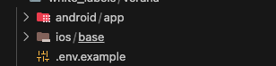
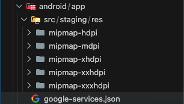
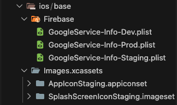
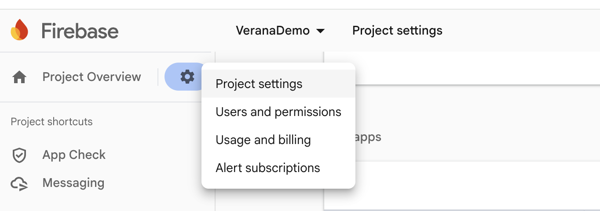
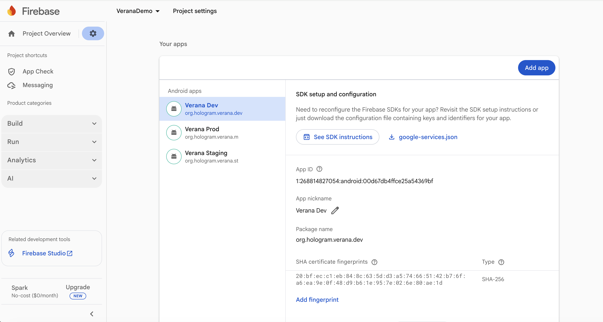
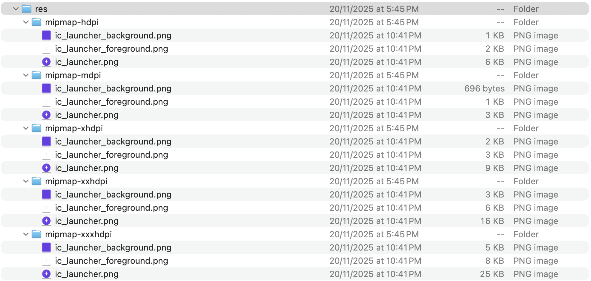
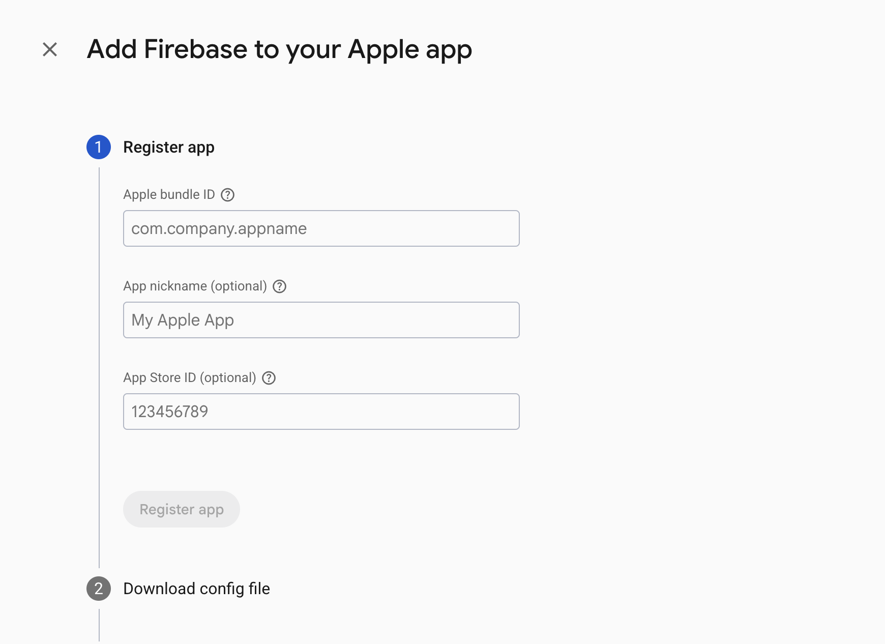

### White Label Setup

One of Hologram's feature is to become it into a custom app. Following a series of steps you will be able to customize your own app name, app icon, splash screen, and app identifiers.

Para customizar la aplicación se necesita modificar 3 lugares claves en este proyecto: android, ios y react-native. Para ello creamos una serie de comandos que vamos a ejectuar por medio de un .sh que nos van ayudar a reemplazar los valores por defecto que tiene la app por los que queremos en nuestro proyecto.

Antes de empezar con el proceso vamos a entender un poco mejor donde y como reemplazar estos valores y que actividades debemos de realizar previo a la ejecución de los comandos.

En el directorio white_labels/verana encontrarás una estrutura de directorios android y ios y un .env.example. Cada uno contiene directorios y archivos con valores por defecto que deberas de reemplazar por los tuyos.



Empezemos con el directorio de android:



Dentro de este directorio se encuentran alojados los recursos necesarios que necesitarás para customizar el icono de tu app y el archivo google-services.json que deberás de reemplazar con el contenido que te genera tu proyecto Firebase para android. Paso que se detallará mas adelante como hacerlo.

Siguiendo con el directorio de ios encontrarás la siguiente estructura:



Dentro del directorio Firebase/ encontraras los 3 archivos relacionados al proyecto Firebase archivos que deberás de llenar con el contenido que te genera tu proyecto Firebase para iOS. Paso que se detallará mas adelante como hacerlo.

Dentro del directorio Images.xcassets nos encontraremos con 2 directorios:

1. AppIconStaging.appiconset dentro de este directorio deberás de colocar todos los iconos necesarios requeridos por apple para asignar el nuevo icono de tu app

2. SplashScreenIconStaging.imageset dentro de este directorio deberás de ubicar tu splash screen icon

Y por ultimo están los archivos ExportOptions.plist y ExportOptionsProd.plist dentro de estos archivos deberás de ubicar los provisioning profiles names y id respectivos. Provisioning profiles que vas a crear en la cuenta desarrolladora de apple más adelante

Nota super importante: Cabe resaltar que la estructura con la que se encuentran construidos estos directorios en white_labels/verana y sus archivos corresponden al como están estructurados los recursos en un proyecto react-native tipico de esta forma el reemplazo de estos valores hacia el proyecto base va a ser mucho mas limpio, sencillo y escalable. Para resumir: Ni los nombres, ni la distribución u organización de los archivos deberán de ser modificados. Solamente su contenido deben de ser modificados.

Teniendo esto muy en cuenta y claro, sigamos.

Por ultimo en el directorio se encuentra el archivo .env.example que cuenta con una serie de variables de entorno que van a ser usadas en los scripts. Dentro de este archivo tenemos las siguiente variables de entorno

- APP_NAME => En esta deberas de colocar el nombre con el que quieres que se vea la app. Ej: "Verana"
- BASE_APP_ID => Aquí deberás de colocar el app id de tu app. Ej: "com.mycompany.verana"
- ANDROID_SPLASH_SCREEN_COLOR => Aqui deberás de asignar el color de fondo en formato hexadecimal del splash screen de la app para Android. Ej: "#6A3DE7"
- ANDROID_FIREBASE_DEBUG_TOKEN => Firebase Debug Token

Nota: Debido a como iOS asigna el color de fondo de un splash screen es necesario que proveamos este color en formato sRGB
debiendo entonces asignar sus respectivos valores para Red, Green y Blue. En el siguiente ejemplo podemos ver los valores que si los convertimos a hexadecimal obtendriamos: #6A3DE7
- IOS_SPLASH_SCREEN_COLOR_R="0.417"
- IOS_SPLASH_SCREEN_COLOR_G="0.239"
- IOS_SPLASH_SCREEN_COLOR_B="0.908"

- APP_ICON_BASE64 => Este es nuestro icono pero en formato base64 esto debido a que en la app vamos a mostrarlo por ejemplo en la pantalla de Registro. Ej: "data:image/png;base64,contentHere...."

Ahora, teniendo ya definido el identificador de nuestra app, debemos saber como va a terminar siendo el identificador final de nuestra app.

Contexto: Esta app cuenta con tres tipos de releases: dev, staging y prod lo que quiere decir es que si queremos y necesitamos vamos a poder tener instalado en nuestros dispositivos esta app 3 veces como apps completamente independientes cada una. Con esto claro, vamos a suponer que tenemos como identificador el valor de "org.hologram.verana" y este el que vamos a asignarle a nuestra variable de entorno BASE_APP_ID en el archivo .env.example, pero debemos de tener muy en cuenta que este "org.hologram.verana" no va a ser el identificador pleno de nuestra app sino que se la va agregar un sufijo al final (.dev, .st ó .m) dependiendo de que tipo de release hagamos a la app. Por ejemplo para el release de la app en dev el identificador final terminaria siendo "org.hologram.verana.dev", para staging seria "org.hologram.verana.st" y para producción seria "org.hologram.verana.m". Por qué es importante saber esto? Porque cuando estemos creando nuestro proyecto de Firebase y los provisioning profiles en apple estos van a pedir que les proveamos cuales van a ser los identificadores de nuestra app tanto en iOS como en Android, entonces vamos a tener que proveerles el valor completo de nuestros identificadores.

## Firebase Android

Con esta breve explicación procedemos a crear el proyecto Firebase e ir haciendo el setup de android.

Contexto: Firebase actualmente se usa en la app para gestionar lo relacionado al envio de Push Notifications al dispositivo y App check para proteger ciertos servicios REST del mediador.

Links de interes:

https://rnfirebase.io/#installation-for-react-native-cli-non-expo-projects

Vamos al siguiente enlace:
https://console.firebase.google.com/

Creamos un proyecto Firebase y luego vamos a crear las apps para Android y iOS. Para ello vamos a ir a "Project settings"



Estando en Project Settings tab General vamos a ver una sección llamada "Your apps" y un botón que dice "Add app" presionamos este botón y luego seleccionamos Android


Diligenciamos estos dos campos teniendo en cuenta que debemos de poner el identificador de nuestra app en Android para el release que queremos configurar para este ejemplo para el release de dev seria: org.hologram.verana.dev y el App Nickname que deseemos damos en Next, Next hasta que terminemos el flujo.

Nota importante: Debido a que la app cuenta con tres tipos de releases DEBEMOS DE CREAR 3 APPS EN TOTAL PARA Android, el proceso de creación es el mismo en todas solo que debemos ir cambiando el Android package name en cada app que creemos. Al final del proceso debemos de quedar con tres apps configuradas para Android como se muestra en la siguiente imagen de ejemplo:



### Firebase Android App Check y Debug Token

Teniendo las 3 apps creadas para Android vamos a Build / App Check y damos click en el botón "Register apps". Deberíamos de ver las 3 apps que acabamos de crear para Android. Presionamos el boton "Register" en cualquiera de estas y deberiamos de ver algo como lo siguiente:


Ahora, para el campo SHA-256 ..... vamos a asignar el siguiente valor que hace referencia al fingerprint del archivo debug.keystore con el cual se firma la app cuando la corremos en modo debug: 20:bf:ec:c1:eb:84:8c:63:5d:d3:a5:74:66:51:42:b7:6f:a6:ea:9e:0f:48:d9:b6:1e:95:7e:02:6e:80:ae:1d

De igual manera si queremos confirmar que efectivamente ese es el SHA correcto procedemos a ejecutar el siguiente comando el cual nos permite obtener información de un archivo .keystore

```bash
keytool -list -v -keystore [full path of the android/app/debug.keystore] -alias androiddebugkey
```


Luego procedemos a dar click en el boton Save para registar nuestra app con App Check. No olvidar que debemos de hacer el registro de nuestras tres apps asignando este mismo SHA en cada una y al final del proceso debemos de tener 3 apps para Android como se muestra en la siguiente imagen:


Aún nos falta un último paso en Android y es obtener el valor para ANDROID_FIREBASE_DEBUG_TOKEN para ello vamos a parar el cursor de nuestro mouse sobre alguna de las apps creada y presionamos el botón de los tres punticos. Para efectos practicos en un video corto vamos a hacer el paso a paso:


<video width="100%" controls>
  <source src="./images/FirebaseAddAndroidDebugTokens.mp4" type="video/mp4">
  Your browser does not support the video tag.
</video>

Un tema importante es guardar el valor del token generado, estos por dos razones importantes:

1. Vamos a hacer el mismo proceso que se hizo en el video para las otras dos apps restantes pero en vez de decirle que genere un token le vamos a asignar el valor del token que acabamos de crear, asi la app móvil usará un mismo debug token para sus 3 releases
2. Vamos a asignarle este valor a nuestra variable de entorno ANDROID_FIREBASE_DEBUG_TOKEN en el archivo .env.example

Habiendo hecho los dos puntos anteriores vamos nuevamente a Project Settings sección Your Apps seleccionamos cualquiera de las 3 apps creadas y presionamos el botón google-services.json para descargar el archivo. Una vez descargado vamos a poner el contenido de este archivo dentro del archivo white_labels/verana/android/app/google-services.json

Ahora solo nos falta crear el icono para nuestra app para Android. Recordemos que el conjunto de iconos que vamos a colocar en white_labels/verana/android/app/src/staging/res deben cumplir con los requisitos y estandares puestos por google para el icono de una app.

Para generar el conjunto de iconos requeridos puedes usar:
https://icon.kitchen/

Esta herramienta te ayuda a generar tu icono con los recursos necesarios no solo para android sino también para iOS aunque como estamos con Android solo vamos usar los recursos para Android màs adelante los de iOS. Ahora ya sea que uses esta herramienta u otra deberas tener una carpeta res con los iconos correspondientes a las diferentes densidades de pantallas para dispostivos Android. Deberias de tener una carpeta con una estructura como la de la siguiente imagen:



Teniendo estos assest de nuestro icono para android procedemos a reemplazar todo lo que tengamos dentro del directorio res en: white_labels/verana/android/app/src/staging/res quedando con una estructura igual a la que tenemos en la imagen, lo unico que se hizo es reemplazar archivos y sus contenidos pero la estructura debe de mantenerse igual

Teniendo ya diligenciado nuestro .env.example, actualizado el contenido del archivo google-services.json y asignado el nuevo assets de icono de la app procedemos a ejecutar el siguiente comando:

```bash
yarn white-label:android
```

### iOS

El proceso de setup en iOS es un poco más extenso ya que para iOS necesitamos estar asociados al Apple Developer Program y adicional debemos de crear los diferentes provisioning profiles para nuestros 3 targets (releases) de la app

Pero empezemos por lo primero, empezemos con la asignación deL icono de nuestro splash screen y nuestro set de iconos para la app en iOS.

Para el icono de nuestra vamos a usar alguna herramienta para generación de iconos como:

https://www.appicon.co/ ó https://icon.kitchen/ recomiendo la última principalmente ya que los nombres de los pngs creados coinciden con los que tiene la app originalmente y adicional sus nombres son dicientes con las dimensiones de cada icono. Si usamos icon.kitchen al descargar el set de iconos vamos a ver una estructura como la siguiente:


En esta imagen podemos ver una gran cantidad de iconos generados pero de todas esas imagenes solo necesitamos 10 en total que son todos ellos menos los que tengan los sufijos de ~ipad.png ni ~car.png ya que la app no compila para estos. Una vez ya tengamos estos 10 assest procedemos a ubicarlos en: white_labels/verana/ios/base/Images.xcassets/AppIconStaging.appiconset.

Si todo sale bien deberiamos de haber sobreescrito los iconos de ejemplo que ya tenia esta directorio destino

Ahora vamos a asingar nuestro icono de la splash screen en formato png, icono que puede tener dimesiones de 515 x 512 ó de 1024 x 1024. Una vez tengamos este png con nombre SplashIcon.png procedemos a ubicarlo en: white_labels/verana/ios/base/Images.xcassets/SplashScreenIconStaging.imageset

Si todo sale bien deberiamos de haber sobreescrito el icono de ejemplo que ya tenia esta directorio destino

Con estos dos pasos ya habremos asignado tanto el icono de la app como el icono de la splash screen para iOS

Siguiendo con iOS debemos ahora de enrolarnos en apple developer program para poder crear una organización y dentro de esta poder crear los diferentes provisioning profiles, certificates y identifiers que se necesitan en xCode para poder compilar la app con sus diferentes capabilities (nfc tag reading, push notifications, etc)

Teniendo ya la organización creada en apple developer program vamos al archivo: white_labels/verana/ios/base/ExportOptions.plist
En este vamos a encontrar una serie de key/values como la siguiente:

```xml
<dict>
  <key>YOUR_APP_ID_FOR_STAGING</key>
  <string>YOUR_PROVISIONING_PROFILE_NAME_FOR_ST_HERE</string>
  <key>YOUR_APP_ID_FOR_STAGING.share</key>
  <string>YOUR_PROVISIONING_PROFILE_NAME_FOR_SHARE_EXTENSION_ST_HERE</string>
</dict>
```

y que debemos de reemplazar por los valores que vamos en nuestra app. Vamos a usar un ejemplo como el siguiente:

```xml
<dict>
    <key>org.hologram.verana.st</key>
    <string>Verana Staging</string>
    <key>org.hologram.verana.st.share</key>
    <string>Verana Share Extension - Staging</string>
</dict>
```

Recordemos que org.hologram.verana.st hace referencia al bundle id de nuestra app en el release de staging y que org.hologram.verana.st.share hace referencia al bundle id de nuestra share extension para staging. Recordemos que estos son valores del ejemplo, deberás de asignar los id correctos de tu app. Ahora, los valores que queramos colocarles a cada key en el tag <string> son completamente libres de asignar solo que se recomienda dejar un nombre relacionado al bundle id al que esta asociado asi como se mostró en el ejemplo

Habiendo ya asignando estos valores en el archivo ExportOptions.plist seguimos con el setup de Firebase para iOS

## Firebase iOS

Así como en Android tuvimos que crear 3 apps también aquí debemos de crear 3 apps para iOS. Para ello vamos a ir a "Project settings"


Estando en Project Settings tab General vamos a ver una sección llamada "Your apps" y un botón que dice "Add app" presionamos este botón y luego seleccionamos Apple iOS



Como podemos ver en la imagen va a ser un proceso practicamente igual al que hicimos para Android, asignamos el app bundle id que para este ejemplo para el release de dev también sería: org.hologram.verana.dev y el App nickname que deseemos, el campo App Store ID de momento no lo dilegenciamos y luego... Next Next hasta terminar el flujo. Recordemos que debemos de tener 3 apps para iOS creadas al final del proceso y debemos de tener 3 apps para iOS asi como se muestra en la siguiente imagen:


### Firebase iOS App Check y Debug Token

Teniendo las 3 apps creadas para iOS vamos a Build / App Check y damos click en el botón "Register apps". Deberíamos de ver las 3 apps que acabamos de crear para iOS. Presionamos el boton "Register" en cualquiera de estas y luego en la opción "App Attest" y deberiamos de ver algo como lo siguiente:


Para el campo Team ID vamos a colocar nuestro Team ID in the Apple Member Center. Pon el cursor del mouse sobre el signo de interrogación para ver la ayuda. Hacemos asi para las 3 apps en iOS y al final del proceso debemos de tener 3 apps para iOS registradas en App Check como se muestra en la siguiente imagen:


Aún nos falta un último paso en iOS asi como lo hicimos en Android y es obtener el valor para IOS_FIREBASE_DEBUG_TOKEN para ello vamos a parar el cursor de nuestro mouse sobre alguna de las apps creada y presionamos el botón de los tres punticos. Para efectos practicos en un video corto vamos a hacer el paso a paso:


<video width="100%" controls>
  <source src="./images/FirebaseAddAiOSDebugTokens.mp4" type="video/mp4">
  Your browser does not support the video tag.
</video>

Un tema importante es guardar el valor del token generado, estos por dos razones importantes:

1. Vamos a hacer el mismo proceso que se hizo en el video para las otras dos apps de iOS restantes pero en vez de decirle que genere un token le vamos a asignar el valor del token que acabamos de crear, asi la app móvil usará un mismo debug token para sus 3 releases
2. Vamos a asignarle este valor a nuestra variable de entorno IOS_FIREBASE_DEBUG_TOKEN en el archivo .env.example


Habiendo hecho los dos puntos anteriores vamos nuevamente a Project Settings sección Your Apps tenemos que por cada app de iOS presionar el botón GoogleService-Info.plist para descargar el .plist de cada una.


En total tendremos 3 archivos descargados y ahora, debemos de ir al directorio: white_labels/verana/ios/base/Firebase dentro de este veremos tres archivos:

- GoogleService-Info-Dev.plist
- GoogleService-Info-Staging.plist
- GoogleService-Info-Prod.plis

Lo que vamos a hacer es que en cada archivo .plist vamos a colocar el contenido que tiene cada uno de los archivos que acabamos de descargar. Es una tarea sencilla pero de mucho cuidado ya que el contenido en cada archivo debera de coincidir con el release que tiene como sufijo en el nombre. Habiendo hecho esto para cada uno de los tres archivos y asegurandonos de que cada archivo contenga el contenido que coincida con el release que tiene procedemos a ejecutar el siguiente comando:

```bash
yarn white-label:ios
```

