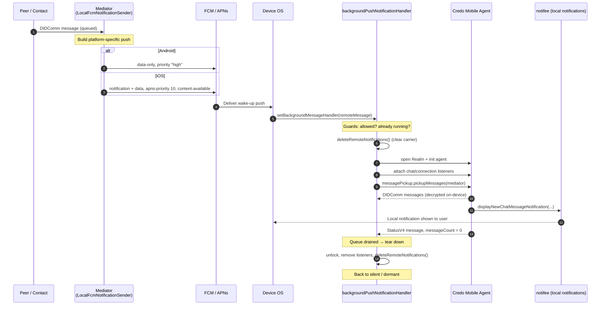

# How Hologram Processes Push Notifications

> Presentation deck + speaker notes. Each slide is self-contained with the code you need.

---

## Slide 0 — The one-liner

> The mediator sends a **content-less wake-up push** (data-only on Android, notification+data
> on iOS to dodge APNs low-priority throttling). The app's **headless background handler opens
> the wallet, runs a DIDComm message pickup**, decrypts messages locally, **renders its own
> local notifications**, and once the mediator queue is empty **tears down and goes silent**.

**Speaker notes:** The push is just a doorbell. The actual message never travels through
Firebase/APNs — it's fetched and decrypted on-device. This is the privacy property that
makes the whole design worth it.

---

## Slide 1 — The big picture (sequence diagram)



**Speaker notes:** Walk left-to-right once, then say "now let's zoom into the three
interesting parts: the *asymmetric push*, the *wake-up handler*, and the *return to silent*."

---

## Slide 2 — Why the push looks different on Android vs iOS

The mediator's `LocalFcmNotificationSender` builds a **different FCM message per platform**:

```ts
// Android — data-only, high priority
message = { token: registrationToken, data, android }
// android: { priority: 'high', collapseKey: 'generic-new-messages' }

// iOS — notification + data, silent but max priority
message = { token: registrationToken, notification, data, apns }
// apns: { headers: { 'apns-priority': '10' }, payload: { aps: { contentAvailable: true } } }
```

| Platform | Payload | Priority | Why |
|----------|---------|----------|-----|
| **Android** | `data` only | `high`, collapse `generic-new-messages` | Data-only high-priority message reliably **wakes the headless JS handler** even when the app is killed. No visible notification needed — the app renders its own. |
| **iOS** | `notification` **+** `data` | `apns-priority: 10`, `content-available` | A *pure* silent push on iOS is treated as **low priority** → throttled / delayed / dropped by APNs. A visible `notification` at max priority **guarantees wake-up + delivery**. |

**The asymmetry in one sentence:** Android can be woken silently and reliably; iOS cannot,
so iOS piggybacks on a visible notification.

**Speaker notes:** This is the "gotcha" slide. The whole platform split exists because
Apple aggressively throttles silent pushes. The visible iOS notification is a *carrier* —
we dismiss it as soon as our handler runs (see Slide 4).

---

## Slide 3 — Registering the handler

The handler is wired up once at startup in `index.js`:

```js
// index.js
setBackgroundMessageHandler(messaging, backgroundPushNotificationHandler)
AppRegistry.registerComponent('hologram', () => (IS_IOS ? AppHeadless : App))
```

On iOS we mount `AppHeadless`, which renders **nothing** while the app was launched only to
process a push — it mounts the real `<App/>` only when the user actually opens it:

```tsx
// src/AppHeadless.tsx
const AppHeadless = () => {
  const [isHeadless, setIsHeadless] = useState(true)
  // ...
  getIsHeadless(messaging).then((headless) => {
    setIsHeadless(headless)
    const userEntersToApp = !headless && appState === 'active'
    if (userEntersToApp) appStateSubscription.current?.remove()
  })
  return isHeadless ? null : <App />   // headless push → render nothing
}
```

**Speaker notes:** `setBackgroundMessageHandler` is the RN Firebase entry point that runs our
handler in quit/background state. `AppHeadless` is a performance guard: we don't boot the
full React UI just to pick up messages in the background.

---

## Slide 4 — The wake-up handler: guards & opening the wallet

```ts
// src/services/backgroundPushNotificationHandler.ts
export async function backgroundPushNotificationHandler(remoteMessage) {
  // 1) Bail if user disabled notifications (handler can still fire)
  if (!(await arePushNotificationsAllowed())) return

  // 2) Clear the "carrier" remote notification (esp. iOS)
  deleteRemoteNotifications()

  // 3) Re-entrancy lock: don't run the flow twice for overlapping pushes
  if (isProcessingBackgroundNotification) return
  isProcessingBackgroundNotification = true

  try {
    // 4) Open the wallet: Realm DB + Credo mobile agent
    const realm = RealmSingleton.instance
    await realm.openRealmIfIsClosed()
    const agent = AgentSingleton.instance
    await agent.setupMobileAgent()
    if (!agent.getMobileAgent()?.isInitialized) {
      await agent.openAndInitMobileAgent()
    }
    // ...continues on next slide
```

**Speaker notes:** Three guards before we do any work: permission check, dismiss the carrier
notification, and the re-entrancy lock (`isProcessingBackgroundNotification`) so two pushes
arriving close together don't both run pickup. Then we open Realm and the Credo agent — this
is "opening the wallet."

---

## Slide 5 — Attaching listeners & running message pickup

```ts
    // 5) Attach listeners that turn incoming messages into notifications
    const { addChatEntryChangeListener, removeChatEntryChangeListener } =
      manageBackgroundChatEntryChanges(realm, agent)
    const { addConnectionChangeListener, removeConnectionChangeListener } =
      manageConnectionStateChangedEvent(agent)
    addChatEntryChangeListener()
    addConnectionChangeListener()
    subscribeToAgentChatEvents(agent, realm, false, () => undefined)
    subscribeToAgentConnectionEvents(agent.context)

    // 6) Pull the queued DIDComm messages from the mediator
    const mediatorRecord = await agent.didcomm.mediationRecipient.findDefaultMediator()
    if (!mediatorRecord) return
    await agent.didcomm.messagePickup.pickupMessages({
      connectionId: mediatorRecord.connectionId,
      protocolVersion: mediatorRecord.protocolVersion === 'v2' ? 'v4' : 'v2',
    })
```

**Speaker notes:** The push told us "there's something waiting." Here we actually go get it:
`pickupMessages` runs the DIDComm Pickup protocol against the mediator connection. As messages
arrive and decrypt, the Realm listener fires (next slide). Content is decrypted **locally** —
it never went through Firebase/APNs.

---

## Slide 6 — Messages → local notifications

A new chat entry in Realm triggers the listener, which renders a **local** notification:

```ts
// src/hooks/agent/chat/manageBackgroundChatEntryChanges.ts
const onChatEntryChange = async (newChatEntries, changes) => {
  for (const index of changes.insertions) {
    const entry = newChatEntries[index]
    if (entry.role !== ChatEntryRole.Receiver) return        // only incoming
    const thread = realm.objects(ChatThread).filtered(`id == '${entry.chatThreadId}'`)[0]
    const connection = await agent.didcomm.connections.findById(thread.connectionId)
    if (!connection) return
    displayNewChatMessageNotification(connection, entry)     // notifee
  }
}
```

```ts
// src/utils/pushNotificationsUtils.ts (displayNewChatMessageNotification, trimmed)
notifee.displayNotification({
  id: `local-notification-chat-${connection.id}-${Date.now()}`,
  title: getConnectionDisplayName(connection),   // real sender name
  body: getLocalizedPreview(chatEntry),          // real message preview
  data: { screen: 'Chat', params: { chatThreadId, connectionId: connection.id } },
  android: optionsNotificationAndroid({ channelId, groupId: connection.id }),
  ios: optionsNotificationsIOS({ threadId: connection.id }),
})
notifee.incrementBadgeCount()
```

**Speaker notes:** This is the payoff. The rich notification the user sees — sender name,
message preview, tap-to-open-chat, grouped per connection, badge count — is built entirely
on-device from decrypted content. The push never carried any of it.

---

## Slide 7 — Going back to silent

The handler listens for the mediator's `StatusV4` message. When the queue is empty, it tears down:

```ts
// src/services/backgroundPushNotificationHandler.ts
agent.events.on(DidCommMessageProcessed, async (data) => {
  const message = data.payload.message
  if (message.type === DidCommStatusV4Message.type.messageTypeUri) {
    const messageCount = message.messageCount
    log(`Status message. Remaining: ${messageCount}`)
    if (messageCount === 0) {              // mediator queue drained
      isProcessingBackgroundNotification = false  // release lock
      deleteRemoteNotifications()                 // clear carrier again
      removeChatEntryChangeListener()
      removeConnectionChangeListener()
    }
  }
})
```

**Speaker notes:** `StatusV4.messageCount === 0` is our "done" signal. We release the
re-entrancy lock, remove the listeners, and clean up notifications. The **agent stays alive** —
the code comment notes that later pushes reuse the same warm agent instead of re-initializing.
The app returns to a dormant/silent state until the next doorbell.

---

## Slide 8 — Recap

1. **Doorbell, not the letter** — push carries only a wake-up signal + tiny data; content is fetched locally.
2. **Platform-asymmetric push** — Android data-only high priority; iOS notification+data to beat APNs throttling.
3. **Headless handler** — opens Realm + Credo agent without booting the UI (iOS `AppHeadless`).
4. **Pickup flow** — `messagePickup.pickupMessages` pulls & decrypts queued DIDComm messages.
5. **Local notifications** — `notifee` renders the rich, real notification on-device.
6. **Back to silent** — `StatusV4 messageCount === 0` → unlock, remove listeners, clean up.

**Privacy takeaway:** message content never transits Firebase or Apple. The push provider
only ever knows "this device has something waiting."
